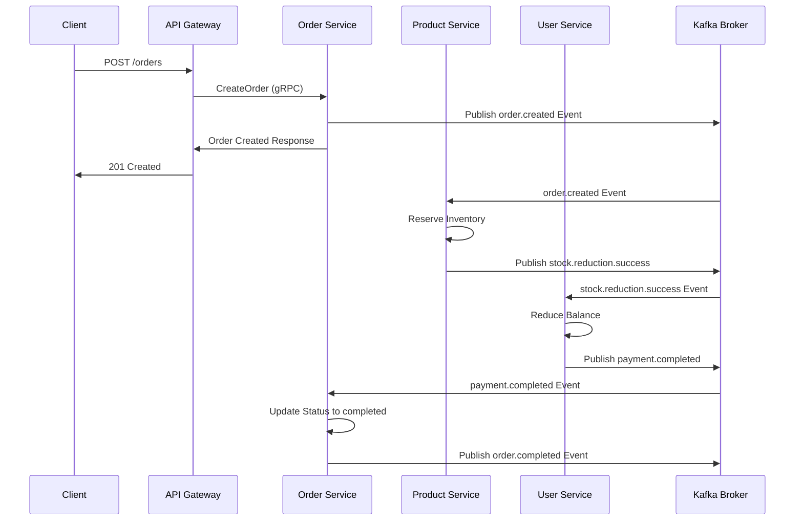

# Untitled

# Microservice Architecture Documentation

## System Overview

This project implements a microservice architecture pattern with multiple services communicating through gRPC and Kafka message broker. The system follows a distributed approach with an API Gateway handling client requests and forwarding them to specialized microservices.

## Architecture Components

### API Gateway & Authentication

- **Technology:** NestJS
- **Responsibilities:**
    - Receives HTTP requests from clients
    - Handles authentication and authorization
    - Routes requests to appropriate microservices via gRPC
    - Stores authentication information in Redis
- **Cache Layer:** Redis for authentication tokens and session management

### Microservices

### Order Service

- **Technology:** Golang
- **Database:** PostgreSQL
- **Responsibilities:** Manages order creation, processing, and lifecycle

### Product Service

- **Technology:** Spring Boot (Kotlin)
- **Database:** PostgreSQL
- **Responsibilities:** Handles product catalog, inventory, and product information

### User Service

- **Technology:** [ASP.NET](http://ASP.NET) Core (C#)
- **Database:** PostgreSQL
- **Responsibilities:** Manages user profiles, preferences, and user-related operations

## Communication Patterns

### Synchronous Communication

- **Protocol:** gRPC
- **Usage:** Real-time request-response communication between API Gateway and microservices
- **Benefits:** High performance, type-safe, efficient binary protocol

### Asynchronous Communication

- **Message Broker:** Apache Kafka
- **Usage:** Event-driven communication for asynchronous operations
- **Pattern:** Saga pattern with choreography-based approach

## Saga Pattern Implementation

The system implements the Saga pattern with choreography-based coordination to maintain data consistency across distributed transactions.

### Choreography-Based Saga

- Each service listens to domain events and decides when to act
- Services publish events to Kafka topics when local transactions complete
- Other services subscribe to relevant events and execute their part of the saga
- Compensating transactions are triggered automatically on failures

## Data Storage

- **Database:** PostgreSQL for all microservices
- **Database per Service:** Each microservice maintains its own database instance
- **Cache:** Redis for authentication data and session management

## Technology Stack Summary

| **Component** | **Technology** | **Purpose** |
| --- | --- | --- |
| API Gateway | NestJS | Request routing & authentication |
| Order Service | Golang | Order management |
| Product Service | Spring Boot | Product catalog |
| User Service | ASP.NET Core | User management |
| Cache | Redis | Authentication & sessions |
| Database | PostgreSQL | Persistent storage |
| Message Broker | Apache Kafka | Event streaming & async messaging |
| RPC Protocol | gRPC | Inter-service communication |

## Key Architectural Benefits

- **Polyglot Architecture:** Each service uses the most appropriate technology for its domain
- **Scalability:** Services can be scaled independently based on demand
- **Resilience:** Saga pattern ensures eventual consistency and handles distributed transaction failures
- **Performance:** gRPC provides efficient synchronous communication, while Kafka handles asynchronous events
- **Maintainability:** Clear separation of concerns with dedicated services for each business domain

## System Overview Diagram

## Order Processing Flow - Saga Pattern (Choreography)

This section illustrates the complete order processing flow using the choreography-based Saga pattern. Each step represents a service performing its local transaction and publishing an event for the next service to consume.

### Happy Path Flow

1. **Create Order**
    - **Service:** Order Service
    - **Action:** Receives order request from API Gateway, validates order details, creates order record with status "created"
    - **Event Published:** `order.created` event to Kafka topic
    - **Database:** Order saved in PostgreSQL with initial status
2. **Reserve Store Inventory**
    - **Service:** Product Service
    - **Trigger:** Listens to `order.created` event
    - **Action:** Checks product availability, reserves inventory for the order items
    - **Event Published:** `stock.reduction.success` event if successful, or `stock.reduction.fail` if insufficient stock
    - **Database:** Updates inventory quantities in PostgreSQL
3. **Reduce User Balance**
    - **Service:** User Service
    - **Trigger:** Listens to `stock.reduction.success` event
    - **Action:** Validates user balance, deducts order amount from user account
    - **Event Published:** `payment.completed` event if successful, or `payment.fail` if insufficient balance
    - **Database:** Updates user balance in PostgreSQL
4**Complete Order**
    - **Service:** Order Service
    - **Trigger:** Listens to `payment.completed` event or shipping confirmation
    - **Action:** Updates order status to "completed", finalizes the transaction
    - **Event Published:** `order.completed` event
    - **Database:** Final order status update in PostgreSQL

### Compensating Transactions (Rollback Flow)

If any step fails, compensating transactions are triggered to maintain consistency:

- **If Inventory Reservation Fails:**
    - Product Service publishes `stock.reduction.fail` event
    - Order Service listens and updates order status to "inventory_reserved_failed" and update failure reason
    - No compensation needed as no previous state was modified
- **If Payment Fails:**
    - User Service publishes `payment.fail` event
    - Product Service listens and releases reserved inventory
    - Order Service listens and updates order status to "payment_failed" and update failure reason

### Event Flow Diagram

### Kafka Topics Structure

| **Topic Name** | **Event Type**          | **Publisher** | **Subscribers** |
| --- |-------------------------| --- | --- |
| order-events | order.created           | Order Service | Product Service |
| inventory-events | stock.reduction.success | Product Service | User Service |
| inventory-events | stock.reduction.fail    | Product Service | Order Service |
| payment-events | payment.completed       | User Service | Order Service |
| payment-events | payment.fail            | User Service | Product Service, Order Service |
| order-events | order.completed         | Order Service | Analytics services |

### Saga State Management

- **Each service maintains its own saga state** in its local database
- **Idempotency:** All event handlers are idempotent to handle duplicate messages
- **Event correlation:** Each event carries an `orderId` for tracking the saga instance
- **Timeout handling:** Services implement timeout mechanisms to detect stuck sagas
- **Dead letter queues:** Failed events are moved to DLQ for manual investigation
- **Transaction outbox pattern:** Services use an outbox table to ensure reliable event publishing after local transaction commits

### Benefits of This Choreography Approach

- **No central coordinator:** Services are loosely coupled and autonomous
- **High scalability:** Each service can process events independently
- **Fault tolerance:** Kafka ensures message delivery and event replay capability
- **Event sourcing ready:** All state changes are captured as events
- **Easy to extend:** New services can subscribe to existing events without modifying publishers

### Order Status Management

**Important Note:** The Order Service acts as the central observer for the entire saga flow. It listens to events from all steps of the process to maintain an accurate, up-to-date order status throughout the transaction lifecycle.
- **Status tracking benefits:**
    - Provides real-time visibility into order progress
    - Enables clients to query current order status through API Gateway
    - Facilitates debugging and monitoring of saga execution
    - Allows for audit trail and compliance reporting
- **Implementation:** Order Service maintains a status history table in PostgreSQL, recording each status transition with timestamp and triggering event

## Avro Schemas for Message Definitions
- All events published to Kafka topics use Avro serialization for efficient, schema-based messaging.
- Schemas are defined for each event type to ensure consistency across services.
- Schemas located in .avro/ directory of the project repository.
