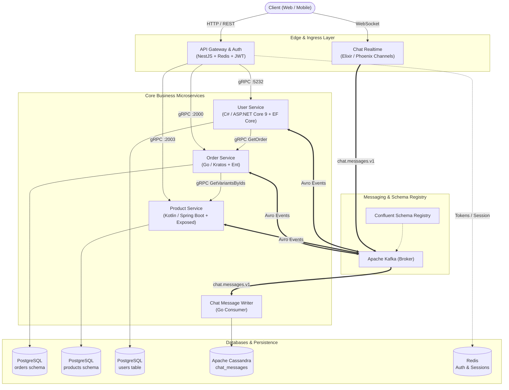
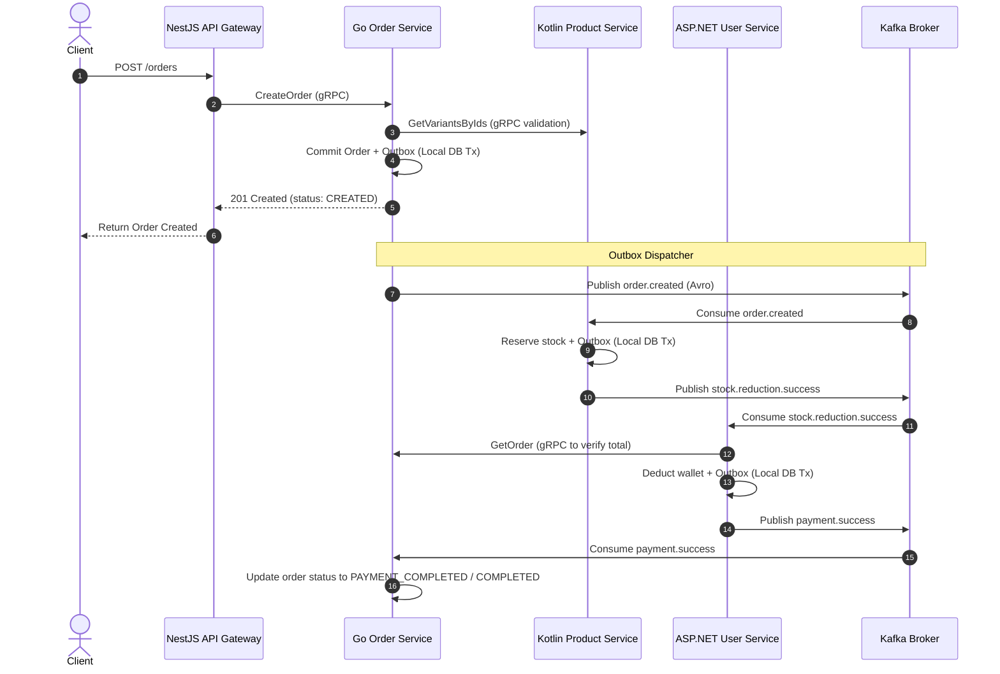
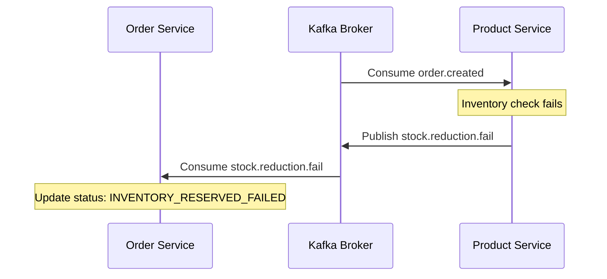
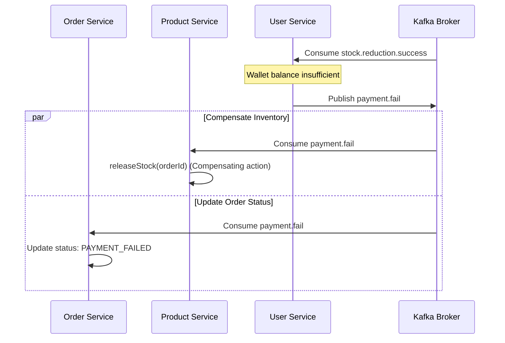
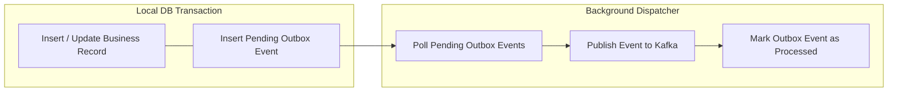

# Polyglot E-Commerce Microservices Platform

A polyglot, event-driven e-commerce microservices platform demonstrating distributed transaction management, asynchronous messaging, and realtime communication.

---

## Table of Contents

- [System Overview](#system-overview)
- [System Architecture Diagram](#system-architecture-diagram)
- [Technology Stack Summary](#technology-stack-summary)
- [Microservices Architecture](#microservices-architecture)
  - [1. API Gateway & Authentication](#1-api-gateway--authentication)
  - [2. Order Service](#2-order-service)
  - [3. Product Service](#3-product-service)
  - [4. User & Payment Service](#4-user--payment-service)
  - [5. Realtime Chat System](#5-realtime-chat-system)
- [Communication & Protocols](#communication--protocols)
  - [Synchronous (gRPC)](#synchronous-communication-grpc)
  - [Asynchronous (Kafka + Avro)](#asynchronous-communication-kafka--avro)
  - [Realtime (WebSockets)](#realtime-communication-websockets)
- [Distributed Transaction Management (Saga Pattern)](#distributed-transaction-management-saga-pattern)
  - [Happy Path Workflow](#happy-path-workflow)
  - [Compensating Transactions (Rollback Flows)](#compensating-transactions-rollback-flows)
  - [Kafka Topics & Event Routing](#kafka-topics--event-routing)
- [Transactional Outbox Pattern](#transactional-outbox-pattern)
- [Shared Contracts & Schemas](#shared-contracts--schemas)
  - [Protobuf Definitions](#protobuf-definitions-proto)
  - [Avro Event Definitions](#avro-event-definitions-avro)
- [Port & Infrastructure Mapping](#port--infrastructure-mapping)
- [Getting Started & Local Development](#getting-started--local-development)

---

## System Overview

In an e-commerce platform, operations such as order placement span multiple business domains: creating an order, verifying pricing, reserving warehouse inventory, and processing customer wallet balance. In a distributed environment, executing these steps cannot rely on traditional two-phase locking (2PC) or distributed database transactions due to latency, availability, and tight coupling bottlenecks.

This system solves this challenge with:
- **Polyglot Design**: Selecting programming languages and frameworks best suited for specific workload requirements (NestJS for fast gateway routing, Go for high-throughput order and persistence workers, Kotlin/Spring Boot for product logic, ASP.NET Core for account and wallet handling, and Elixir/Phoenix for high-concurrency WebSockets).
- **Choreography-based Saga**: Each microservice listens to domain events, executes its local database transaction, and publishes subsequent domain events to Apache Kafka without relying on a central orchestrator.
- **Transactional Outbox Pattern**: Services record business mutations and domain events atomically within a single local transaction, with dedicated background dispatchers streaming events to Kafka to eliminate dual-write hazards.
- **Strict Contracts**: Using [Protocol Buffers](file:///Users/edward/Documents/e-commerce-microservice/.proto) for internal gRPC RPCs and [Apache Avro](file:///Users/edward/Documents/e-commerce-microservice/.avro) schemas for Kafka event payloads.

---

## System Architecture Diagram


### Extended End-to-End Topology


```mermaid
flowchart TD
    Client(["Client (Web / Mobile)"])

    subgraph Edge ["Edge & Ingress Layer"]
        Gateway["API Gateway & Auth\n(NestJS + Redis + JWT)"]
        PhoenixChat["Chat Realtime\n(Elixir / Phoenix Channels)"]
    end

    subgraph Services ["Core Business Microservices"]
        OrderSvc["Order Service\n(Go / Kratos + Ent)"]
        ProductSvc["Product Service\n(Kotlin / Spring Boot + Exposed)"]
        UserSvc["User Service\n(C# / ASP.NET Core 9 + EF Core)"]
        ChatWriter["Chat Message Writer\n(Go Consumer)"]
    end

    subgraph Messaging ["Messaging & Schema Registry"]
        Kafka["Apache Kafka (Broker)"]
        SchemaRegistry["Confluent Schema Registry"]
    end

    subgraph Storage ["Databases & Persistence"]
        PG_Order[("PostgreSQL\norders schema")]
        PG_Product[("PostgreSQL\nproducts schema")]
        PG_User[("PostgreSQL\nusers table")]
        Cassandra[("Apache Cassandra\nchat_messages")]
        Redis[("Redis\nAuth & Sessions")]
    end

    Client -->|HTTP / REST| Gateway
    Client -->|WebSocket| PhoenixChat

    Gateway -->|gRPC :2000| OrderSvc
    Gateway -->|gRPC :2003| ProductSvc
    Gateway -->|gRPC :5232| UserSvc
    Gateway -.->|Tokens / Session| Redis

    OrderSvc -->|gRPC GetVariantsByIds| ProductSvc
    UserSvc -->|gRPC GetOrder| OrderSvc

    OrderSvc --> PG_Order
    ProductSvc --> PG_Product
    UserSvc --> PG_User
    ChatWriter --> Cassandra

    OrderSvc <==>|Avro Events| Kafka
    ProductSvc <==>|Avro Events| Kafka
    UserSvc <==>|Avro Events| Kafka
    PhoenixChat ==>|chat.messages.v1| Kafka
    Kafka ==>|chat.messages.v1| ChatWriter
    SchemaRegistry -.-> Kafka
```

---

## Technology Stack Summary

| Component | Framework / Language | Persistence / Storage | Role |
| :--- | :--- | :--- | :--- |
| **API Gateway** | [NestJS 11](file:///Users/edward/Documents/e-commerce-microservice/nest-api-gateway-auth) (TypeScript / Node.js) | Redis 6.2 | REST API entry point, JWT auth, Swagger docs, gRPC proxy |
| **Order Service** | [Go-Kratos v2](file:///Users/edward/Documents/e-commerce-microservice/golang-order-kratos) (Go 1.23+) + Ent ORM | PostgreSQL (`orders` schema) | Order lifecycle, outbox dispatcher, saga status observer |
| **Product Service** | [Spring Boot 3.4](file:///Users/edward/Documents/e-commerce-microservice/spring-boot-product) (Kotlin) + Exposed ORM | PostgreSQL (`products` schema) | Product catalog, stock reservations, rollback compensation |
| **User Service** | [ASP.NET Core 9](file:///Users/edward/Documents/e-commerce-microservice/asp-user) (C#) + EF Core | PostgreSQL (`public` schema) | User accounts, credentials, wallet balance deductions |
| **Chat Realtime** | [Phoenix Framework](file:///Users/edward/Documents/e-commerce-microservice/chat/phoenix-chat) (Elixir / BEAM) | In-Memory / Mnesia / Cache | WebSocket connections, presence, instant fanout, Avro producer |
| **Chat Writer** | [Go](file:///Users/edward/Documents/e-commerce-microservice/chat/message-writer) + gocql | Apache Cassandra | Kafka consumer, idempotent chat message persistence |
| **Broker** | Apache Kafka (Confluent cp-kafka KRaft) | Disk | Asynchronous event streaming and saga event transport |
| **Schema Registry** | Confluent cp-schema-registry | Kafka Store | Schema registry for Avro message governance |
| **RPC** | gRPC / Protocol Buffers (v3) | N/A | High-performance synchronous inter-service communication |

---

## Microservices Architecture

### 1. API Gateway & Authentication
- **Location:** [`/nest-api-gateway-auth`](file:///Users/edward/Documents/e-commerce-microservice/nest-api-gateway-auth)
- **Key Modules:**
  - [`auth/`](file:///Users/edward/Documents/e-commerce-microservice/nest-api-gateway-auth/src/auth): Handles user login, registration, and token validation via [`AuthGuard`](file:///Users/edward/Documents/e-commerce-microservice/nest-api-gateway-auth/src/auth/auth.guard.ts).
  - [`orders/`](file:///Users/edward/Documents/e-commerce-microservice/nest-api-gateway-auth/src/orders): Proxies `POST /orders`, `GET /orders`, and `GET /orders/:id` directly to Order Service via gRPC.
  - [`products/`](file:///Users/edward/Documents/e-commerce-microservice/nest-api-gateway-auth/src/products): Proxies catalog queries and mutations to Product Service.
  - [`users/`](file:///Users/edward/Documents/e-commerce-microservice/nest-api-gateway-auth/src/users): User profile lookups and password updates.
- **Features:**
  - Auto-generated Swagger documentation at `http://localhost:3000/docs`.
  - Redis cache integration for access tokens and user sessions.
  - Centralized exception translation via [`GlobalExceptionsFilter`](file:///Users/edward/Documents/e-commerce-microservice/nest-api-gateway-auth/src/exceptions/global-exceptions.filter.ts).

### 2. Order Service
- **Location:** [`/golang-order-kratos`](file:///Users/edward/Documents/e-commerce-microservice/golang-order-kratos)
- **Architecture Pattern:** Clean Architecture / DDD (Domain-Driven Design):
  - [`internal/biz`](file:///Users/edward/Documents/e-commerce-microservice/golang-order-kratos/internal/biz): Domain entities and business use cases ([`OrderUsecase`](file:///Users/edward/Documents/e-commerce-microservice/golang-order-kratos/internal/biz/order.go)).
  - [`internal/data`](file:///Users/edward/Documents/e-commerce-microservice/golang-order-kratos/internal/data): Database access via [Ent ORM](file:///Users/edward/Documents/e-commerce-microservice/golang-order-kratos/schema), gRPC variant catalog client ([`variant_catalog.go`](file:///Users/edward/Documents/e-commerce-microservice/golang-order-kratos/internal/data/variant_catalog.go)), and Kafka producer.
  - [`internal/service`](file:///Users/edward/Documents/e-commerce-microservice/golang-order-kratos/internal/service): gRPC transport handlers implementing [`OrderServiceServer`](file:///Users/edward/Documents/e-commerce-microservice/golang-order-kratos/internal/service/order.go).
  - [`internal/worker`](file:///Users/edward/Documents/e-commerce-microservice/golang-order-kratos/internal/worker):
    - [`outbox.go`](file:///Users/edward/Documents/e-commerce-microservice/golang-order-kratos/internal/worker/outbox.go): Background dispatcher querying pending outbox records and pushing to Kafka.
    - [`consumer.go`](file:///Users/edward/Documents/e-commerce-microservice/golang-order-kratos/internal/worker/consumer.go): Subscribes to downstream saga events to update the order state.
- **Responsibilities:**
  - Validates requested product variants and prices with Product Service before order creation.
  - Persists order and initial `order.created` outbox entry in one atomic database transaction.
  - Tracks the distributed order status throughout the entire Saga lifecycle.

### 3. Product Service
- **Location:** [`/spring-boot-product`](file:///Users/edward/Documents/e-commerce-microservice/spring-boot-product)
- **Key Components:**
  - **Data Layer:** PostgreSQL (schema `products`) managed with Flyway migrations and JetBrains Exposed ORM tables: [`ProductsTable`](file:///Users/edward/Documents/e-commerce-microservice/spring-boot-product/src/main/kotlin/com/ecommerce/springboot/product/database/ProductsTable.kt), [`VariantsTable`](file:///Users/edward/Documents/e-commerce-microservice/spring-boot-product/src/main/kotlin/com/ecommerce/springboot/product/database/VariantsTable.kt), [`OptionTypesTable`](file:///Users/edward/Documents/e-commerce-microservice/spring-boot-product/src/main/kotlin/com/ecommerce/springboot/product/database/OptionTypesTable.kt), [`KafkaOutboxTable`](file:///Users/edward/Documents/e-commerce-microservice/spring-boot-product/src/main/kotlin/com/ecommerce/springboot/product/database/KafkaOutboxTable.kt).
  - [`StockConsumer.kt`](file:///Users/edward/Documents/e-commerce-microservice/spring-boot-product/src/main/kotlin/com/ecommerce/springboot/product/consumers/StockConsumer.kt): Kafka listener for `order.created` and `payment.fail`.
  - [`KafkaOutboxPublisher.kt`](file:///Users/edward/Documents/e-commerce-microservice/spring-boot-product/src/main/kotlin/com/ecommerce/springboot/product/services/KafkaOutboxPublisher.kt): Scheduled worker claiming unpublished outbox batches and sending them to Kafka.
- **Responsibilities:**
  - Product catalog and variant definitions.
  - Stock reservation: verifies item inventory and decrements stock.
  - Stock compensation: releases previously reserved stock when payment fails.

### 4. User & Payment Service
- **Location:** [`/asp-user`](file:///Users/edward/Documents/e-commerce-microservice/asp-user)
- **Key Components:**
  - **Data Layer:** Entity Framework Core with code-first migrations (`AppDbContext`) managing users and outbox messages.
  - [`Consumers/UserConsumer.cs`](file:///Users/edward/Documents/e-commerce-microservice/asp-user/Consumers/UserConsumer.cs): Consumes `stock.reduction.success` events.
  - [`GrpcServiceClients/OrderServiceClient.cs`](file:///Users/edward/Documents/e-commerce-microservice/asp-user/GrpcServiceClients/OrderServiceClient.cs): Queries Order Service over gRPC to retrieve authoritative order totals.
  - [`Outbox/OutboxDispatchService.cs`](file:///Users/edward/Documents/e-commerce-microservice/asp-user/Outbox/OutboxDispatchService.cs): Background service polling outbox rows and pushing Avro events to Kafka.
- **Responsibilities:**
  - User identity, profile data, and credential management.
  - Customer wallet operations: atomic balance verification, wallet deduction, and failure event emission on insufficient balance.

### 5. Realtime Chat System
- **Location:** [`/chat`](file:///Users/edward/Documents/e-commerce-microservice/chat)
- Built as two decoupled microservices:
  1. **[`phoenix-chat`](file:///Users/edward/Documents/e-commerce-microservice/chat/phoenix-chat) (Elixir / Phoenix Channels):**
     - Accepts WebSocket connections at `ws://localhost:4001/socket/websocket?user_id=<user-id>`.
     - Validates room membership and blocks via [`MembershipCache`](file:///Users/edward/Documents/e-commerce-microservice/chat/phoenix-chat/lib/chat_realtime/membership_cache.ex) and [`BlockCache`](file:///Users/edward/Documents/e-commerce-microservice/chat/phoenix-chat/lib/chat_realtime/block_cache.ex).
     - Delivers incoming `message:send` directly to the recipient's channel topic in memory (`message:new`) for sub-millisecond delivery.
     - Encodes the message into Avro binary ([`chat_message_sent.avsc`](file:///Users/edward/Documents/e-commerce-microservice/.avro/chat_message_sent.avsc)) using Avrora and produces it to Kafka topic `chat.messages.v1`.
  2. **[`message-writer`](file:///Users/edward/Documents/e-commerce-microservice/chat/message-writer) (Go + Cassandra):**
     - Consumes `chat.messages.v1` events from Kafka.
     - Performs idempotent `INSERT INTO chat_messages (...) VALUES (...) IF NOT EXISTS` into Apache Cassandra.
     - Provides a local HTTP validator API for room verification.

---

## Communication & Protocols

### Synchronous Communication (gRPC)
Synchronous inter-service requests use gRPC over HTTP/2 with Protocol Buffers v3:
- **API Gateway $\rightarrow$ Microservices**: Gateway forwards client HTTP requests to Order, Product, and User services.
- **Order Service $\rightarrow$ Product Service**: Order Service invokes `GetVariantsByIds` on Product Service to validate item prices and inventory existence before creating the order.
- **User Service $\rightarrow$ Order Service**: User Service calls `GetOrder` on Order Service to confirm the order amount before deducting the user wallet.

### Asynchronous Communication (Kafka + Avro)
All domain events are published to Kafka using Apache Avro schemas. Avro provides binary serialization efficiency, schema evolution safety, and contract enforcement across languages.

### Realtime Communication (WebSockets)
Chat clients establish WebSocket connections with Phoenix Channels, utilizing BEAM lightweight processes to maintain thousands of concurrent connections with minimal memory overhead.

---

## Distributed Transaction Management (Saga Pattern)

The system orchestrates multi-service order processing using a **Choreography-based Saga**, where each microservice performs its local database operation and reacts to events emitted by other services.

### Happy Path Workflow


```mermaid
sequenceDiagram
    autonumber
    actor Client
    participant Gateway as NestJS API Gateway
    participant OrderSvc as Go Order Service
    participant ProductSvc as Kotlin Product Service
    participant UserSvc as ASP.NET User Service
    participant Kafka as Kafka Broker

    Client->>Gateway: POST /orders
    Gateway->>OrderSvc: CreateOrder (gRPC)
    OrderSvc->>ProductSvc: GetVariantsByIds (gRPC validation)
    OrderSvc->>OrderSvc: Commit Order + Outbox (Local DB Tx)
    OrderSvc-->>Gateway: 201 Created (status: CREATED)
    Gateway-->>Client: Return Order Created

    Note over OrderSvc,Kafka: Outbox Dispatcher
    OrderSvc->>Kafka: Publish order.created (Avro)
    
    Kafka->>ProductSvc: Consume order.created
    ProductSvc->>ProductSvc: Reserve stock + Outbox (Local DB Tx)
    ProductSvc->>Kafka: Publish stock.reduction.success
    
    Kafka->>UserSvc: Consume stock.reduction.success
    UserSvc->>OrderSvc: GetOrder (gRPC to verify total)
    UserSvc->>UserSvc: Deduct wallet + Outbox (Local DB Tx)
    UserSvc->>Kafka: Publish payment.success
    
    Kafka->>OrderSvc: Consume payment.success
    OrderSvc->>OrderSvc: Update order status to PAYMENT_COMPLETED / COMPLETED
```

1. **Order Creation:** Client sends `POST /orders`. Order Service validates variants with Product Service via gRPC, then inserts the order record (status: `CREATED`) and writes an `order.created` event into its `outboxevent` table.
2. **Event Dispatch:** The Order Service outbox dispatcher publishes the event to Kafka topic `order.created`.
3. **Inventory Reservation:** Product Service consumes `order.created`. It checks variant stock availability, reserves the quantities, and inserts a `stock.reduction.success` outbox event in PostgreSQL.
4. **Wallet Deduction:** User Service consumes `stock.reduction.success`. It verifies the order amount via gRPC call to Order Service, deducts the amount from the user's wallet, and enqueues a `payment.success` event.
5. **Order Completion:** Order Service consumes `payment.success` and updates the order status to `COMPLETED`.

---

### Compensating Transactions (Rollback Flows)

If any stage in the saga encounters a business failure, compensating actions are automatically triggered:

#### Scenario A: Insufficient Inventory

```mermaid
sequenceDiagram
    participant OrderSvc as Order Service
    participant Kafka as Kafka Broker
    participant ProductSvc as Product Service

    Kafka->>ProductSvc: Consume order.created
    Note over ProductSvc: Inventory check fails
    ProductSvc->>Kafka: Publish stock.reduction.fail
    Kafka->>OrderSvc: Consume stock.reduction.fail
    Note over OrderSvc: Update status: INVENTORY_RESERVED_FAILED
```

#### Scenario B: Insufficient Wallet Balance

```mermaid
sequenceDiagram
    participant OrderSvc as Order Service
    participant ProductSvc as Product Service
    participant UserSvc as User Service
    participant Kafka as Kafka Broker

    Kafka->>UserSvc: Consume stock.reduction.success
    Note over UserSvc: Wallet balance insufficient
    UserSvc->>Kafka: Publish payment.fail
    
    par Compensate Inventory
        Kafka->>ProductSvc: Consume payment.fail
        ProductSvc->>ProductSvc: releaseStock(orderId) (Compensating action)
    and Update Order Status
        Kafka->>OrderSvc: Consume payment.fail
        OrderSvc->>OrderSvc: Update status: PAYMENT_FAILED
    end
```

---

### Kafka Topics & Event Routing

| Topic Name | Event Schema | Publisher | Subscribers | Trigger / Action |
| :--- | :--- | :--- | :--- | :--- |
| `order.created` | [`order.created.avsc`](file:///Users/edward/Documents/e-commerce-microservice/.avro/order.created.avsc) | Order Service | Product Service | Triggers warehouse stock reservation |
| `stock.reduction.success` | [`stock.reduction.success.avsc`](file:///Users/edward/Documents/e-commerce-microservice/.avro/stock.reduction.success.avsc) | Product Service | User Service, Order Service | Triggers user wallet balance deduction |
| `stock.reduction.fail` | [`stock.reduction.fail.avsc`](file:///Users/edward/Documents/e-commerce-microservice/.avro/stock.reduction.fail.avsc) | Product Service | Order Service | Marks order `INVENTORY_RESERVED_FAILED` |
| `payment.success` | [`payment.success.avsc`](file:///Users/edward/Documents/e-commerce-microservice/.avro/payment.success.avsc) | User Service | Order Service | Marks order status `COMPLETED` |
| `payment.fail` | [`payment.fail.avsc`](file:///Users/edward/Documents/e-commerce-microservice/.avro/payment.fail.avsc) | User Service | Product Service, Order Service | Triggers stock release rollback & marks `PAYMENT_FAILED` |
| `chat.messages.v1` | [`chat_message_sent.avsc`](file:///Users/edward/Documents/e-commerce-microservice/.avro/chat_message_sent.avsc) | Phoenix Chat | Chat Message Writer | Asynchronous chat persistence into Cassandra |

---

## Transactional Outbox Pattern

Directly writing to a database and publishing to Kafka in application code introduces dual-write hazards: if Kafka fails or the network drops after the database commit, the event is lost; conversely, publishing before commit risks phantom events if the transaction aborts.

To guarantee **at-least-once delivery** and data consistency:
1. **Local Atomic Commit:** Each microservice writes its business data mutation and corresponding event record into an outbox table in the **same database transaction**.
2. **Asynchronous Polling Dispatcher:** A separate background worker periodically claims pending outbox rows, serializes them to Avro, publishes them to Kafka, and marks them as processed upon broker acknowledgment.


```mermaid
flowchart LR
    subgraph ServiceTransaction ["Local DB Transaction"]
        BizOp["Insert / Update Business Record"]
        OutboxInsert["Insert Pending Outbox Event"]
    end

    subgraph OutboxWorker ["Background Dispatcher"]
        Poll["Poll Pending Outbox Events"]
        Publish["Publish Event to Kafka"]
        Ack["Mark Outbox Event as Processed"]
    end

    BizOp --- OutboxInsert
    OutboxInsert --> Poll
    Poll --> Publish
    Publish --> Ack
```

### Implementation Matrix

| Service | Outbox Table | Dispatcher Implementation |
| :--- | :--- | :--- |
| **Order Service** | [`outbox_events`](file:///Users/edward/Documents/e-commerce-microservice/golang-order-kratos/schema/outboxevent.go) | [`OutboxDispatcher.Start()`](file:///Users/edward/Documents/e-commerce-microservice/golang-order-kratos/internal/worker/outbox.go) (Go ticker loop) |
| **Product Service** | [`kafka_outbox`](file:///Users/edward/Documents/e-commerce-microservice/spring-boot-product/src/main/kotlin/com/ecommerce/springboot/product/database/KafkaOutboxTable.kt) | [`KafkaOutboxPublisher.publishPendingMessages()`](file:///Users/edward/Documents/e-commerce-microservice/spring-boot-product/src/main/kotlin/com/ecommerce/springboot/product/services/KafkaOutboxPublisher.kt) (`@Scheduled`) |
| **User Service** | [`outbox_messages`](file:///Users/edward/Documents/e-commerce-microservice/asp-user/Migrations/20260318090000_AddOutboxMessages.cs) | [`OutboxDispatchService`](file:///Users/edward/Documents/e-commerce-microservice/asp-user/Outbox/OutboxDispatchService.cs) (ASP.NET `BackgroundService`) |

---

## Shared Contracts & Schemas

### Protobuf Definitions (`/.proto`)
- [`Order.proto`](file:///Users/edward/Documents/e-commerce-microservice/.proto/Order.proto): Defines `OrderService` (`CreateOrder`, `GetOrder`, `GetOrders`), `OrderStatus` enum, and order item models.
- [`Product.proto`](file:///Users/edward/Documents/e-commerce-microservice/.proto/Product.proto): Defines `ProductService`, `OptionService`, and `VariantService` (`CreateProduct`, `GetProducts`, `GetVariantsByIds`).
- [`User.proto`](file:///Users/edward/Documents/e-commerce-microservice/.proto/User.proto): Defines `UserService` (`GetUserById`, `CreateUser`, `GetUserByEmailAndPassword`, `ChangePassword`).
- [`Payment.proto`](file:///Users/edward/Documents/e-commerce-microservice/.proto/Payment.proto): Defines payment intent RPCs (`CreateIntent`, `CancelIntent`).

### Avro Event Definitions (`/.avro`)
- [`order.created.avsc`](file:///Users/edward/Documents/e-commerce-microservice/.avro/order.created.avsc): Payload containing order ID, customer ID, total price, and item variant quantities.
- [`stock.reduction.success.avsc`](file:///Users/edward/Documents/e-commerce-microservice/.avro/stock.reduction.success.avsc): Emitted when inventory reservation succeeds.
- [`stock.reduction.fail.avsc`](file:///Users/edward/Documents/e-commerce-microservice/.avro/stock.reduction.fail.avsc): Emitted when inventory is insufficient.
- [`payment.success.avsc`](file:///Users/edward/Documents/e-commerce-microservice/.avro/payment.success.avsc): Emitted when customer wallet balance deduction succeeds.
- [`payment.fail.avsc`](file:///Users/edward/Documents/e-commerce-microservice/.avro/payment.fail.avsc): Emitted when wallet balance is insufficient.
- [`chat_message_sent.avsc`](file:///Users/edward/Documents/e-commerce-microservice/.avro/chat_message_sent.avsc): Realtime message payload (`message_id`, `room_id`, `sender_id`, `body`, `sent_at`).

---

## Port & Infrastructure Mapping

| Service / Infrastructure | Default Port | Protocol | Documentation / Endpoint |
| :--- | :--- | :--- | :--- |
| **API Gateway** | `3000` | HTTP | Swagger UI: `http://localhost:3000/docs` |
| **Order Service** | `2000` | gRPC | `OrderService` endpoints |
| **Product Service** | `2003` | gRPC | `ProductService`, `VariantService` |
| **User Service** | `5232` | gRPC | `UserService` endpoints |
| **Phoenix Chat** | `4001` | WebSocket / HTTP | `ws://localhost:4001/socket/websocket` |
| **Chat Message Writer** | `8080` | HTTP | Room validator health/query endpoints |
| **Kafka Broker** | `9092` / `29092` | Kafka Binary | Kafka broker endpoint (KRaft mode) |
| **Confluent Schema Registry** | `8081` | HTTP | `http://localhost:8081` |
| **Redis** | `6379` | Redis Protocol | Gateway token and session storage |
| **PostgreSQL** | `5432` | PostgreSQL | Schemas: `orders`, `products`, `public` |
| **Apache Cassandra** | `9042` | CQL | Keyspace: `chat_messages` table |

---

## Getting Started & Local Development

### Prerequisites
- [Docker & Docker Compose](https://www.docker.com/)
- [Node.js](https://nodejs.org/) (v20+) & `npm`
- [Go](https://go.dev/) (1.23+)
- [.NET SDK](https://dotnet.microsoft.com/) (9.0)
- [Java Development Kit](https://adoptium.net/) (JDK 17+)
- [Elixir & Erlang/OTP](https://elixir-lang.org/) (v1.17+)

### 1. Start Infrastructure (Kafka & Schema Registry)
Start Kafka in KRaft mode and Confluent Schema Registry using the root compose file:
```bash
docker compose up -d
```

### 2. Databases & Caching
Ensure local PostgreSQL (port `5432`), Redis (port `6379`), and Cassandra (port `9042`) instances are running. Each service includes local compose configurations in its folder (e.g., [`golang-order-kratos/docker-compose.yml`](file:///Users/edward/Documents/e-commerce-microservice/golang-order-kratos/docker-compose.yml), [`spring-boot-product/docker-compose.yml`](file:///Users/edward/Documents/e-commerce-microservice/spring-boot-product/docker-compose.yml), [`asp-user/docker-compose.yml`](file:///Users/edward/Documents/e-commerce-microservice/asp-user/docker-compose.yml)).

### 3. Start Backend Services
Use the repository orchestration scripts in [`/.shell`](file:///Users/edward/Documents/e-commerce-microservice/.shell):
```bash
# Start all core backend services in background
bash .shell/start-all.sh

# Stop all running background services
bash .shell/stop-all.sh
```

Or run individual services manually:
```bash
# 1. API Gateway
cd nest-api-gateway-auth && npm install && npm run start:dev

# 2. Order Service
cd golang-order-kratos && go run cmd/order/main.go

# 3. Product Service
cd spring-boot-product && ./gradlew bootRun

# 4. User Service
cd asp-user && dotnet run

# 5. Realtime Chat Service
cd chat/phoenix-chat && mix deps.get && mix phx.server

# 6. Chat Message Writer
cd chat/message-writer && go run cmd/chat-message-writer/main.go
```

### 4. Code Generation Workflows
- **TypeScript Protobufs (Gateway):** `cd nest-api-gateway-auth && npm run proto:gen`
- **Go Ent & Protobufs:** `cd golang-order-kratos && go generate ./...`
